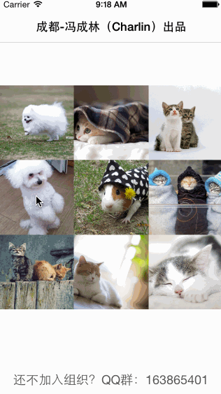
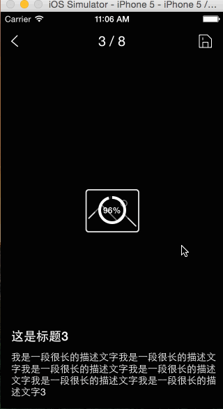
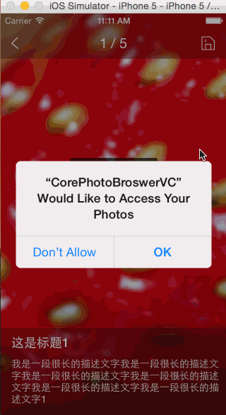

    Charlin出框架的目标：简单、易用、实用、高度封装、绝对解耦！

 

 

## 秒杀MJPhotobswer, CorePhotoBroswerVC 2.0版本

快速集成高性能照片浏览器，支持本地及网络相册！ 

 

#### 框架说明 DESC 
>.本框架是全新原创。本版本是2.0版本，此框架费时大概30天左右了，还在不断完善中，而且还有很多小细节需要处理，如果你在使用中发现bug，请加群@我，我会尽快修改。  
>.如果你在示例程序中，加载网络图片，你会发现图片显示有点乱，因为缩略图我是使用的是本地图片，所以正式使用的时候是不会有问题的。  
>.本框架包含了很多本地图片以及gif示例演示图片，所以包有点大，大概50MB左右，真正框架很小。请放心使用。  
>.再次申明，本版本还有很多地方需要完善，后续会继续更新！谢谢！

   
#### 友情提示 MENTION 
成都iOS开发群： 
二群：369870753（新开，新鲜着呢，快加）  
一群：163865401（已爆满，加不上了）    
   

#### 2.0版本特性 FEATURE 
全新2.0版本，主要添加了众多切换方式，以及多种切换效果，供大家任意选取，请看Charlin给你展示： 
  

##### Push方式展示(图片较大，请耐心等待) 
   

##### modal方式展示(图片较大，请耐心等待) 
   

##### transition方式展示(图片较大，请耐心等待) 
   

##### zoom方式展示(图片较大，请耐心等待) 
   

后期会继续增加一个展示方式，请期待！！！
  
#### 细节说明： 
zoom方式下，有非常多的细节，这里截图说明一二 
##### 如果你在放大图片的情况下，直接关闭相册浏览器，则框架会做一个连续动画(图片较大，请耐心等待)
  

##### 如果相册浏览器退出时对应图片超出屏幕之外，此时会以另外一种动画方式展示(图片较大，请耐心等待)
  

#### 使用示例 EXAMPLE 
    /*
     *  本地图片展示
     */
    -(void)localImageShow:(NSUInteger)index{
        
        //避免循环引用
        __weak typeof(self) weakSelf=self;
    
        [PhotoBroswerVC show:self type:PhotoBroswerVCTypeZoom index:index photoModelBlock:^NSArray *{
        
        NSArray *localImages = weakSelf.images;
        
        NSMutableArray *modelsM = [NSMutableArray arrayWithCapacity:localImages.count];
        for (NSUInteger i = 0; i< localImages.count; i++) {
            
            PhotoModel *pbModel=[[PhotoModel alloc] init];
            pbModel.mid = i + 1;
            pbModel.title = [NSString stringWithFormat:@"这是标题%@",@(i+1)];
            pbModel.desc = [NSString stringWithFormat:@"我是一段很长的描述文字我是一段很长的描述文字我是一段很长的描述文字我是一段很长的描述文字我是一段很长的描述文字我是一段很长的描述文字%@",@(i+1)];
            pbModel.image = localImages[i];
            
            //源frame
            UIImageView *imageV =(UIImageView *) weakSelf.contentView.subviews[i];
            pbModel.sourceImageView = imageV;
            
            [modelsM addObject:pbModel];
        }
        
        return modelsM;
        }];
    }
    
    
    /*
     *  展示网络图片
     */
    -(void)networkImageShow:(NSUInteger)index{
        
        //避免循环引用
        __weak typeof(self) weakSelf=self;
    
        [PhotoBroswerVC show:self type:PhotoBroswerVCTypeZoom index:index photoModelBlock:^NSArray *{
        
        
        NSArray *networkImages=@[
                          @"http://www.netbian.com/d/file/20150519/f2897426d8747f2704f3d1e4c2e33fc2.jpg",
                          @"http://www.netbian.com/d/file/20130502/701d50ab1c8ca5b5a7515b0098b7c3f3.jpg",
                          @"http://www.netbian.com/d/file/20110418/48d30d13ae088fd80fde8b4f6f4e73f9.jpg",
                          @"http://www.netbian.com/d/file/20150318/869f76bbd095942d8ca03ad4ad45fc80.jpg",
                          @"http://www.netbian.com/d/file/20110424/b69ac12af595efc2473a93bc26c276b2.jpg",
                          
                          @"http://www.netbian.com/d/file/20140522/3e939daa0343d438195b710902590ea0.jpg",
                          
                          @"http://www.netbian.com/d/file/20141018/7ccbfeb9f47a729ffd6ac45115a647a3.jpg",
                          
                          @"http://www.netbian.com/d/file/20140724/fefe4f48b5563da35ff3e5b6aa091af4.jpg",
                          
                          @"http://www.netbian.com/d/file/20140529/95e170155a843061397b4bbcb1cefc50.jpg"
                          ];
        
        NSMutableArray *modelsM = [NSMutableArray arrayWithCapacity:networkImages.count];
        for (NSUInteger i = 0; i< networkImages.count; i++) {
            
            PhotoModel *pbModel=[[PhotoModel alloc] init];
            pbModel.mid = i + 1;
            pbModel.title = [NSString stringWithFormat:@"这是标题%@",@(i+1)];
            pbModel.desc = [NSString stringWithFormat:@"我是一段很长的描述文字我是一段很长的描述文字我是一段很长的描述文字我是一段很长的描述文字我是一段很长的描述文字我是一段很长的描述文字%@",@(i+1)];
            pbModel.image_HD_U = networkImages[i];
            
            //源frame
            UIImageView *imageV =(UIImageView *) weakSelf.contentView.subviews[i];
            pbModel.sourceImageView = imageV;
            
            [modelsM addObject:pbModel];
        }
        
        return modelsM;
    }];
}

   

### 以下是1.0版本说明

#### 写在之前 FIRST 
官人要是觉得本框架还不错，请支持我，支持码农的无偿付出！不用给钱，右上角star或者fork一下就可以，谢谢你的支持！ 
本框架主要目标是快速集成，目前，照片浏览器太多了，好用的还没多少， MJ有一个不错，可惜年代久远，bug太多，而且长久没有维护更新，其他框架大多使用复杂，难以自定义。  

#### 特别说明 SPECIAL 
本框架制作细节太多了，考虑的问题极多，绝对不是简单的scrollView设置一下paginEnable就可以这么简单，目前是直接push版本（高仿网易新闻），后续会增加frame放大版本（仿新浪微博及微信朋友圈照片浏览器）。  

#### 精彩截图 SCREEN（动态图片较大，请耐心等待） 

###### 展示网络图片相册 
  

###### 展示本地图片相册 
  

###### 网络或者本地图片保存到手机系统相册 
  
  

#### 框架特性 FRATURE 
>.ios版本兼容ios 7.0及以上. 
>.高仿网易新闻，后期将加入仿微信及新浪微博。 
>.xib定制界面，适配所有屏幕，同时方便你自定义你的功能，你想增加删除控件非常方便。 
>.好看的进度指示器，占位图片及HUD集成。 
>.各种手势处理，含显示隐藏界面信息，导航条，双击放大，双指捏合缩放。 
>.加入了比较fastion的图片间距，每页图片之前会有一个间距，这样几页图片不会粘在一起，更加美观（网易居然都没加）。 
>.图片保存系统相册功能，及保存过的图片不会重复保存（我试过新浪微博会重复保存）。 
>.任意图片尺寸能够以最合理的方式展示，含复杂的图片frame计算。 
>.支持本地图片展示、支持网络图片展示，支持指定index展示（从第index张展示，不一定是第0张）。 
>.修复了双击放大可能后位置有点偏移的bug。 
>.高性能，使用tableView一样的cell缓存池重用机制，性能极佳（重用带来了若干bug，目前已经修复，可能还有，请查看默认log地内存址）。 
>.后期将加入比较帅气的frame放大功能，敬请期待！！！！！！ 

  

#### Charlin想说 SAY 
此版本最开始是使用ColletionView来做的，后面在collectionView的cell里面增加scrollView会出现ios7下乱跳的bug，无法解决，后来只有换成scrollView。这个框架其他就是细节太多了，如果有兴趣可以看看源码，会发现里面有太多稀奇古怪的bug修复，因为里面太多控件太多手势杂糅在一起。可能还是有很多bug，可以加我群成都iOS开发群_Charlin：163865401讨论。  

 
#### 框架依赖 APPEND（本框架默认集成以下框架，最新到我这里查看https://github.com/nsdictionary?tab=repositories） 
>.CoreSDWebImage 
>.CoreArchive 
>.CoreCategory 
>.CoreSVP 
>.LFRoundProgressView 
>.CoreExtend 

  

#### 使用示例 EXAMPLE
    
    - (IBAction)showAction:(id)sender {
        
        //本地图片展示
        [self localImageShow];
        
        //展示网络图片
    //    [self networkImageShow];
    }
    
    /*
     *  本地图片展示
     */
    -(void)localImageShow{
        
        [PhotoBroswerVC show:self index:2 photoModelBlock:^NSArray *{
            
            NSArray *localImages = @[
                                     
                                     [UIImage imageNamed:@"15"],
                                     [UIImage imageNamed:@"14"],
                                     [UIImage imageNamed:@"13"],
                                     [UIImage imageNamed:@"12"],
                                     [UIImage imageNamed:@"11"]
                                     ];
            
            NSMutableArray *modelsM = [NSMutableArray arrayWithCapacity:localImages.count];
            for (NSUInteger i = 0; i< localImages.count; i++) {
                
                PhotoModel *pbModel=[[PhotoModel alloc] init];
                pbModel.mid = i + 1;
                pbModel.title = [NSString stringWithFormat:@"这是标题%@",@(i+1)];
                pbModel.desc = [NSString stringWithFormat:@"我是一段很长的描述文字我是一段很长的描述文字我是一段很长的描述文字我是一段很长的描述文字我是一段很长的描述文字我是一段很长的描述文字%@",@(i+1)];
                pbModel.image = localImages[i];
                
                [modelsM addObject:pbModel];
            }
            
            return modelsM;
            
        }];
    }
    
    
    /*
     *  展示网络图片
     */
    -(void)networkImageShow{
        
        [PhotoBroswerVC show:self index:2 photoModelBlock:^NSArray *{
            
            
            NSArray *networkImages=@[
                              @"http://www.fevte.com/data/attachment/forum/day_110425/110425102470ac33f571bc1c88.jpg",
                              @"http://www.netbian.com/d/file/20150505/5a760278eb985d8da2455e3334ad0c0f.jpg",
                              @"http://www.netbian.com/d/file/20141006/e9d6f04046d483843d353d7a301d36f8.jpg",
                              @"http://www.netbian.com/d/file/20130906/134dca4108f3f0ed10a4cc3f78848856.jpg",
                              @"http://www.netbian.com/d/file/20121111/a03b9adb18a982f6a49aa7bfa7b82371.jpg",
                              @"http://www.netbian.com/d/file/20130421/e0dabeee4e1e62fe114799bc7e4ccd66.jpg",
                              @"http://www.netbian.com/d/file/20121012/c890c1da17bb5b4291e9733fad8efb42.jpg",
                              @"http://www.netbian.com/d/file/20150318/c5c68492a4d6998229d1b6068c77951e.jpg0"
                              ];
            
            NSMutableArray *modelsM = [NSMutableArray arrayWithCapacity:networkImages.count];
            for (NSUInteger i = 0; i< networkImages.count; i++) {
                
                PhotoModel *pbModel=[[PhotoModel alloc] init];
                pbModel.mid = i + 1;
                pbModel.title = [NSString stringWithFormat:@"这是标题%@",@(i+1)];
                pbModel.desc = [NSString stringWithFormat:@"我是一段很长的描述文字我是一段很长的描述文字我是一段很长的描述文字我是一段很长的描述文字我是一段很长的描述文字我是一段很长的描述文字%@",@(i+1)];
                pbModel.image_HD_U = networkImages[i];
                
                [modelsM addObject:pbModel];
            }
            
            return modelsM;
            
            
        }];
    }

  

   

-----
    CorePhotoBroswerVC 快速集成高性能照片浏览器，支持本地及网络相册！！
-----

   

#### 版权说明 RIGHTS  
作品说明：本框架由iOS开发攻城狮Charlin制作。 
作品时间： 2015.05.10 10:07  

